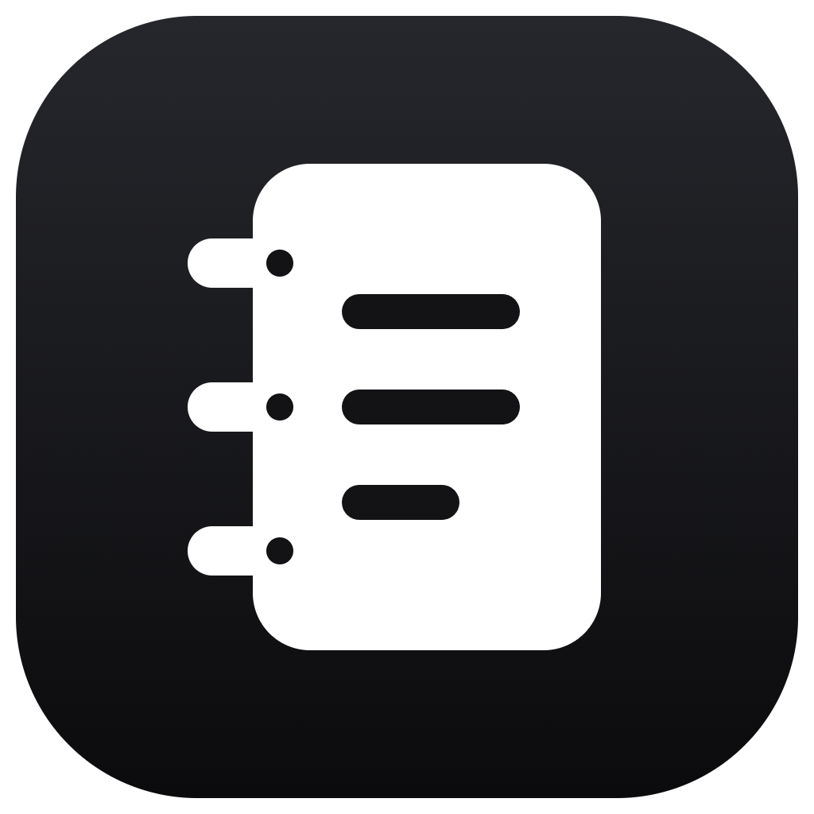

<p align="center">
  
</p>

<h1 align="center">Carnet</h1>

<p align="center">
  Un carnet de notes de bureau : pages imbriquées, tâches et liens entre pages.<br />
  Plus riche qu'un dossier de notes, plus simple que Notion. Tout reste sur votre machine.
</p>

<p align="center">
  <a href="https://github.com/Luth-infinity/carnet/releases/latest">Télécharger la dernière version</a>
</p>

## Installation

**Windows** : lancez `Carnet-Setup-<version>-x64.exe` (ou `arm64` pour un PC ARM). L'installation se fait en un clic, sans droits administrateur. Windows SmartScreen peut afficher « Windows a protégé votre ordinateur » : cliquez sur « Informations complémentaires » puis « Exécuter quand même », l'application n'étant pas signée. Les mises à jour suivantes s'installent ensuite depuis l'application.

**macOS** : ouvrez `Carnet-<version>-arm64.dmg` (Apple Silicon) ou `x64` (Intel) et glissez Carnet dans Applications. Au premier lancement, faites un clic droit sur l'application puis « Ouvrir » : elle n'est pas notariée. L'application signale ensuite les nouvelles versions.

## Fonctions

- Pages imbriquées, réorganisables par glisser-déposer dans la barre latérale
- Éditeur par blocs : menu `/`, raccourcis Markdown, barre de mise en forme à la sélection, poignée pour déplacer les blocs
- Titres, listes, tâches imbriquées, citations, encadrés colorés, sections dépliantes, tableaux, code avec coloration
- Liens entre pages avec `@`, et rétroliens « Mentionnée dans » en bas de chaque page
- Vue Tâches qui regroupe toutes les cases à cocher de toutes les pages, avec ajout rapide
- Note du jour, rangée sous une page Journal
- Icône, couverture, police (défaut, serif, mono) et pleine largeur par page
- Palette de commandes avec recherche dans le contenu des pages
- Favoris, corbeille, export Markdown d'une page, sauvegarde et restauration de tout le carnet
- Thème clair, sombre ou système

| Raccourci | Action |
| --- | --- |
| `Ctrl K` | Palette de commandes |
| `Ctrl N` | Nouvelle page |
| `Ctrl J` | Note du jour |
| `Ctrl \` | Afficher ou masquer la barre latérale |
| `/` | Insérer un bloc |
| `@` | Lier une page |
| `Ctrl Entrée` | Cocher la tâche courante |

Sur macOS, `Ctrl` devient `⌘`.

## Données

Les notes sont enregistrées au fil de la frappe dans le profil de l'application (`%APPDATA%\Carnet` sous Windows, `~/Library/Application Support/Carnet` sous macOS). Rien n'est envoyé en ligne : la seule requête réseau vérifie s'il existe une nouvelle version sur GitHub. Réglages → « Exporter une sauvegarde » produit un fichier JSON qui se restaure sur une autre machine.

## Développement

```bash
npm install
npm run desktop   # Next.js en mode dev + fenêtre Electron
npm run dev       # interface seule, dans un navigateur (http://localhost:3217)
npm start         # export statique puis Electron, comme une fois installée
npm run dist:win  # installeurs Windows dans release/
```

Next.js 16 (export statique), Tailwind 4, shadcn/ui, Tiptap 3, Zustand, Electron 41. Voir [CLAUDE.md](CLAUDE.md) pour l'architecture et la procédure de release.

## Licence

MIT
